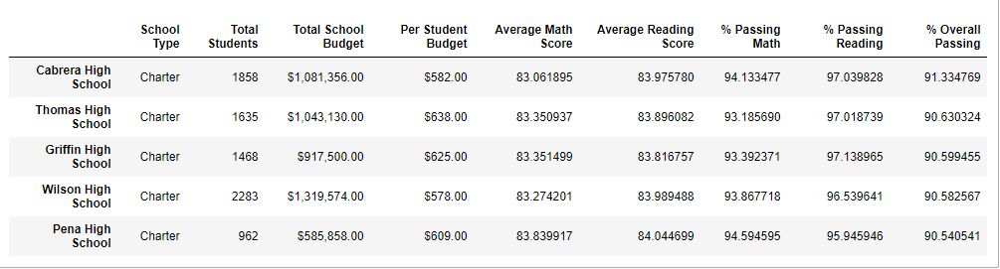

# School District Analysis

## Overview of the school district analysis: 

The State Board of Education has detected a discrepancy within ninth grade class’s marks for reading and math at Thomas High School. The decision was to replace the math and reading scores for Thomas High School with NaNs while keeping the rest of the data intact, in order to meet the state-testing standards and analyze the overall performance of high schools in the district.
The purpose of this analysis is to determine the overall performance of Thomas High School within the City School District, with and without the altered score data for reading and math of ninth grade class. 

## Results:
The decision to replace the math and reading scores for Thomas High School has changed the possition of the School in the ranking.
Below are the perfomance of higher and lower ranking HIgh Schools. 

## District Summary 

The analysis indicated that overall affect on the discrit summary was unnoticiable unless you round it to the tenth of a grade point.  

## School Summary 
As shown below, the grade passing percentages for Thomas High School fell drastically, having the ninth-grade scores replaced with NaN. This was due to the fact having replaced 9th grade sccores, we were still using the total number of students at the Thomas High School. There was no affect on Thomas High School's performance among other schools. Thomas High School is ranked second in both scenarios.

### Thomas High School with 9th grade class grades

### Thomas High School without 9th grade class grades

### High Performing Schools

### Low Performing Schools

### Scores by School Type

Charter Schools had highter scores over District Schools. 

### Scores by School Spending

Replacing Thomas High School 9th grade class grades had no effect on school spending. Schools which spend <$585 had higher performance scores. 

### Scores by School Size
Replacing Thomas High School 9th grade class grades had no effect on school size. 
Schools in range of 1000-2000 students had higher performance scores

### Math & Reading scores by grade
The results were calculated with a removed the 9th grade math and reading scores for Thomas High School. Thus, the grades for all other classes and schools remained unchanged.

#### Math

#### Reading 

## Summary
-   Having replaced the 9th grade Thomas High School students with Nan, based on our analysis this change had several affects
    -   Passing math percentage was changed by 23%
    -   Passing reading percentage was changed by 27%
    -   Overall passing percentage of student was changed by 26%
    -   Thomas High School ranking was changed as well

